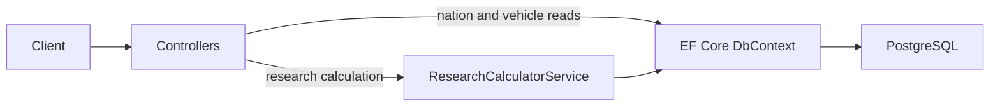

# Grinding Thunder API

ASP.NET Core backend for planning War Thunder vehicle progression. It models versioned vehicle prerequisites and rank gates so a player can estimate the remaining Research Points (RP), Silver Lions (SL), and matches needed to reach a target vehicle.

## Overview

Grinding Thunder API follows a selected tech-tree snapshot to calculate the remaining Research Points (RP), vehicle-purchase Silver Lions (SL), mandatory prerequisite vehicles, and estimated matches needed to reach a target vehicle from the player's current progress.

The current API exposes nations, research trees, versions, version-owned ranks, and vehicle entries. The calculator requires a `ResearchTreeVersionId`, traverses only that version's explicit prerequisite graph, includes player-selected vehicles needed toward rank gates, totals remaining RP and SL, and estimates matches from both average RP and average net SL earned per match. It does not persist player inventories, select rank-gate fillers automatically, or provide an admin publishing workflow.

Development seed data currently contains USA, USSR, Germany, and Great Britain ground research trees (plus any trees already in the database), a sample `dev-sample` game update with one published tree version each, and a small sample of USA vehicles. This sample does not represent complete game coverage.

## Key Features

- List nations with their research trees, tree versions, version-owned ranks, and data-driven rank unlock thresholds.
- List stable vehicles with versioned tree entries, or filter entries by nation and vehicle type.
- Calculate the explicit prerequisite graph for a target vehicle in a caller-selected tree version.
- Treat supplied unlocked vehicles as traversal boundaries and exclude them from both RP and SL totals.
- Include player-selected filler targets and their prerequisite lines.
- Report the first unmet rank quota below the target rank.
- Total RP and vehicle-purchase SL from the same deduplicated set of remaining entries.
- Estimate RP and SL matches independently with ceiling division, then report the greater value as the combined estimate.

See [Product](docs/PRODUCT.md) for the implemented scope, intended behavior, and future direction.

## Domain

The core domain separates progression dependencies from how the tech tree is displayed:

- A `Vehicle` represents a stable vehicle identity.
- Prerequisite edges form a directed graph; tree rows and columns do not imply progression requirements.
- Rank unlock requirements come from data rather than hard-coded calculator rules.
- RP cost, SL cost, rank, placement, folder membership, and prerequisites belong to versioned tech-tree snapshots because they can change between game updates.
- Published snapshots are intended to be immutable historical records.

The implemented model keeps `Vehicle` as stable identity. `VehicleTreeEntry` owns version-specific costs, rank association, layout, and folder membership; `TreeRank` owns version-specific rank-gate configuration; and `VehiclePrerequisite` links entries within one `ResearchTreeVersion`. Database constraints prevent prerequisite and folder relationships from crossing version boundaries. Research availability and acquisition type remain future versioned concerns. The canonical concepts and remaining gaps are documented in [Domain](docs/DOMAIN.md).

## Architecture

The repository is a modular monolith with one ASP.NET Core production project. Its folders provide organization, but they are not separate .NET projects and do not enforce compile-time boundaries.



- `Controllers` handles HTTP requests. Read controllers query EF Core directly; the research controller delegates to the calculator service.
- `Application` contains calculation request and result records.
- `Domain` contains the current entities and calculator service interface.
- `Infrastructure` contains EF Core persistence, migrations, development seeding, and the calculator implementation.

One current dependency does not match the intended boundary: the service interface in `Domain` uses records from `Application`. The project intentionally avoids adding architectural frameworks or splitting into multiple services without a concrete need. See [Architecture](docs/ARCHITECTURE.md) for the current state and target direction.

## Database

The API uses Entity Framework Core with PostgreSQL. The current schema is defined by checked-in migrations and contains these main tables:

| Table | Purpose |
| --- | --- |
| `Nations` | Stable nation identity (name). |
| `VehicleTypes` | Stable tree-type identity (Ground, Aviation, ...). |
| `ResearchTrees` | One unique Nation + VehicleType combination. |
| `GameUpdates` | War Thunder update identity: unique version string, optional name and release date. |
| `ResearchTreeVersions` | One tree's snapshot for one update (unique pair), with a Draft/Published status. |
| `TreeRanks` | Version-owned rank numbers and required unlocked-vehicle counts. |
| `Vehicles` | Stable vehicle identity: name and optional image URL. |
| `VehicleTreeEntries` | Version-specific vehicle membership, RP/SL costs, rank association, layout, and optional same-version folder parent. |
| `VehiclePrerequisites` | Explicit prerequisite edges between entries in the same tree version. |

In the Development environment, application startup applies pending migrations and inserts sample data when the corresponding tables are empty. [Database](docs/DATABASE.md) describes the implemented versioned schema, its integrity constraints, and the remaining conceptual target.

## Tech Stack

- .NET 10 and ASP.NET Core Web API
- Entity Framework Core 10
- Npgsql EF Core provider
- PostgreSQL
- ASP.NET Core OpenAPI document generation in Development
- Docker multi-stage build using the .NET 10 SDK and ASP.NET Core runtime images

## Prerequisites

- [.NET 10 SDK](https://dotnet.microsoft.com/download/dotnet/10.0)
- PostgreSQL accessible to the application
- Docker, only if building or running the container image

## Getting Started

1. Restore and build the project:

   ```console
   dotnet restore GrindingThunder.Api.csproj
   dotnet build GrindingThunder.Api.csproj --no-restore
   ```

2. Configure a PostgreSQL connection. The application reads `ConnectionStrings:DefaultConnection`. Prefer overriding the checked-in local default with an environment variable or .NET user secrets:

   ```console
   dotnet user-secrets set "ConnectionStrings:DefaultConnection" "Host=localhost;Port=5432;Database=warthunder_db;Username=postgres;Password=YOUR_PASSWORD" --project GrindingThunder.Api.csproj
   ```

3. Run the Development launch profile:

   ```console
   dotnet run --project GrindingThunder.Api.csproj --launch-profile http
   ```

   The profile listens on `http://localhost:5034`. On startup, the application connects to PostgreSQL, applies its EF Core migrations, and seeds the development sample data. The PostgreSQL user must have the permissions required to create or update the configured database schema.

4. With the application running, the Development OpenAPI document is available at `http://localhost:5034/openapi/v1.json`.

## Configuration

Configuration follows standard ASP.NET Core configuration precedence. The repository defines these application-specific settings:

| Setting | Environment variable | Purpose |
| --- | --- | --- |
| `ConnectionStrings:DefaultConnection` | `ConnectionStrings__DefaultConnection` | PostgreSQL connection used by EF Core. |
| `ASPNETCORE_ENVIRONMENT` | `ASPNETCORE_ENVIRONMENT` | Use `Development` to enable migration, sample seeding, and OpenAPI mapping. |

The `http` launch profile sets `ASPNETCORE_ENVIRONMENT=Development`. Do not commit production credentials; use environment variables or user secrets for sensitive local values.

The CORS policy currently permits `http://localhost:3000` only.

## API Surface

| Method | Route | Purpose |
| --- | --- | --- |
| `GET` | `/api/nations` | List nations with research trees, vehicle types, versions, ranks, and unlock thresholds. |
| `GET` | `/api/vehicles` | List stable vehicles, their versioned entries, and prerequisite data. |
| `GET` | `/api/vehicles/tree?nationId={id}&type={type}` | List versioned entries for a nation, optionally filtered by vehicle-type name. |
| `POST` | `/api/research/calculate` | Calculate remaining vehicles, RP, SL, resource-specific match estimates, the combined estimate, and the first rank deficit. |

`POST /api/research/calculate` expects this JSON shape:

```json
{
  "researchTreeVersionId": "00000000-0000-0000-0000-000000000000",
  "targetVehicleId": "00000000-0000-0000-0000-000000000000",
  "unlockedVehicleIds": [],
  "fillerTargetIds": [],
  "averageRpPerMatch": 2500,
  "averageNetSlPerMatch": 10000
}
```

Both averages must be positive, and every supplied vehicle ID must exist in the selected version. An unknown version returns `404`; invalid IDs, membership, or averages return `400`. A successful response contains `targetVehicleId`, `totalRpRequired`, `totalSlRequired`, `rpEstimatedMatches`, `slEstimatedMatches`, `estimatedMatches`, per-vehicle RP/SL summaries in `requiredVehicles`, and any first unmet rank gate in `rankDeficits`. Use the nation and vehicle endpoints to obtain IDs from the current database.

## Development

Run with automatic rebuild and hot reload:

```console
dotnet watch --project GrindingThunder.Api.csproj run --launch-profile http
```

Create a release build:

```console
dotnet build GrindingThunder.Api.csproj -c Release
```

Build the provided container image:

```console
docker build -t grinding-thunder-api .
```

The image listens on port `8080`. A running container still requires a reachable PostgreSQL instance and an appropriate `ConnectionStrings__DefaultConnection` value. Migration and seed startup behavior occurs only when the container environment is `Development`.

## Testing

The solution includes an xUnit test project (`GrindingThunder.Api.Tests`) covering the research calculator and persistence behavior. SQLite in-memory databases are used so tests do not require PostgreSQL:

```console
dotnet test
```

## Project Structure

```text
.
|-- Application/                 # Calculation request and result models
|-- Controllers/                 # HTTP API controllers
|-- Domain/                      # Entities and calculator contract
|-- GrindingThunder.Api.Tests/  # xUnit tests (calculator + persistence, SQLite in-memory)
|-- Infrastructure/
|   |-- Persistence/             # DbContext, mappings, migrations, and seed data
|   `-- Services/                # Research calculator implementation
|-- docs/                        # Canonical product and design documentation
|-- Program.cs                   # Application composition and middleware
|-- GrindingThunder.Api.csproj   # Project and NuGet dependencies
|-- GrindingThunder.Api.sln      # Solution (API + test project)
`-- Dockerfile                   # Production image build
```

## Documentation

- [Product](docs/PRODUCT.md) — current behavior, target scope, and future direction
- [Domain](docs/DOMAIN.md) — domain concepts, invariants, and model gaps
- [Architecture](docs/ARCHITECTURE.md) — current boundaries and architectural direction
- [Database](docs/DATABASE.md) — implemented persistence model and conceptual target
- [Decisions](docs/DECISIONS.md) — chronological log of significant design decisions per batch
- [Roadmap](docs/ROADMAP.md) — batch status and implementation sequence
- [Development workflow](docs/WORKFLOW.md) — batch execution and verification process
- [Project instructions](AGENTS.md) — engineering and documentation conventions
